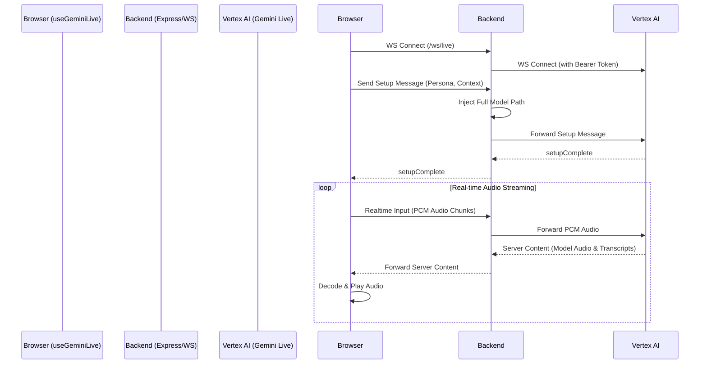

# Feature Deep Dive: Gemini Live WebSocket Implementation

This document details the architecture and implementation of the real-time audio chat feature in ArtLens AI, powered by the **Gemini Live 2.5 Flash Native Audio API**.

The feature is split into two main components:
1. **Frontend Hook (`hooks/useGeminiLive.ts`):** Manages the browser's Web Audio API (microphone capture, audio playback queue) and communicates with the backend via WebSocket.
2. **Backend Proxy (`server/ws/live.ts`):** Acts as a secure intermediary between the browser and Vertex AI, handling authentication and routing WebSocket messages.

---

## 1. System Architecture & Flow

To securely use Vertex AI from a browser without exposing Google Cloud credentials, the application uses a WebSocket proxy architecture.

---

## 2. Backend Proxy (`server/ws/live.ts`)

The backend component is a pure pass-through proxy with three specific responsibilities:

### A. Authentication & Security
The browser connects to `/ws/live` without credentials (relying on the existing session if needed). The backend intercepts the first message, fetches a Google Cloud Application Default Credential (ADC) token, and opens the upstream connection to `wss://<region>-aiplatform.googleapis.com/...`.

### B. Message Modification (Setup)
The Vertex AI Live API requires a full model resource path (e.g., `projects/.../locations/.../publishers/google/models/...`). The frontend only sends the short name (`gemini-live-2.5-flash-native-audio`). The backend intercepts the `setup` message, injects the full path using environment variables, and forwards it to Vertex AI.

### C. Session Management
To prevent resource exhaustion, the backend enforces a hard `SESSION_TIMEOUT_MS` (currently 15 minutes). If the timer fires, it closes both the browser and upstream WebSockets.

---

## 3. Frontend Hook (`hooks/useGeminiLive.ts`)

The frontend heavily utilizes the Web Audio API to handle continuous, bidirectional audio streaming.

### A. Setup and Context Injection
When `connect()` is called, the hook builds a dynamic `systemInstruction` that merges:
- The user's chosen **Persona** (Guide, Academic, Blogger).
- The **Artwork Data** (Title, Artist, Description).
- The **Deep Analysis Data** (Historical context, symbolism) injected asynchronously if available.

### B. Audio Input (Microphone)
1. Acquires microphone permission via `navigator.mediaDevices.getUserMedia`.
2. Creates an `AudioContext` at 16kHz (Vertex AI requirement for input).
3. Uses a `ScriptProcessorNode` (chunk size 4096) to capture raw PCM data from the microphone.
4. Converts the Float32 PCM data to base64 and sends it via the WebSocket as `realtime_input.media_chunks`.

*(Note: `ScriptProcessorNode` is deprecated but used here for broad browser compatibility. Migration to `AudioWorkletNode` is a noted improvement opportunity).*

### C. Audio Output (Playback Queue)
Because Vertex AI streams audio back in chunks, the frontend must queue and play them seamlessly.
1. Creates a second `AudioContext` at 24kHz (Vertex AI output frequency).
2. Base64 audio chunks from the server are decoded using `ctx.decodeAudioData()`.
3. An `AudioBufferSourceNode` is created for each chunk.
4. The hook maintains a `nextStartTimeRef` to schedule the chunks back-to-back using `source.start(nextStartTimeRef)`.

### D. Transcriptions and Interruptions
- **Transcriptions:** The server returns `inputTranscription` (user) and `outputTranscription` (model). These are concatenated and exposed via the `setOnTranscript` callback for the UI to render.
- **Interruptions:** If the user interrupts the model (by speaking while the model is speaking), Vertex AI sends an `interrupted: true` signal. The hook immediately stops all scheduled `AudioBufferSourceNode`s and clears the playback queue.

---

## 4. Key Considerations & Gotchas

- **Audio Context Suspension:** Browsers strictly enforce autoplay policies. `AudioContext` instances start in a `suspended` state until a user interacts with the page. The hook calls `ensureAudioContext()` (which calls `.resume()`) inside user-triggered functions like `toggleMute()` and `sendTextInput()`.
- **Mute State Handling:** Muting is handled locally by disabling the `MediaStreamTrack` (`track.enabled = false`) rather than disconnecting the WebSocket. This allows the connection to remain warm.
- **Cleanup:** Proper cleanup is critical to prevent microphone locking and memory leaks. The `cleanup` function ensures both `AudioContext`s are closed, media tracks are stopped, WebSockets are terminated, and source nodes are disconnected on component unmount.
